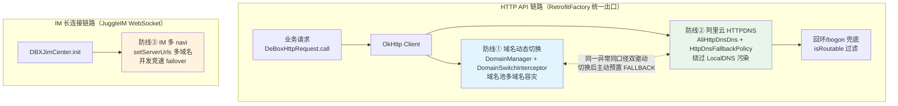
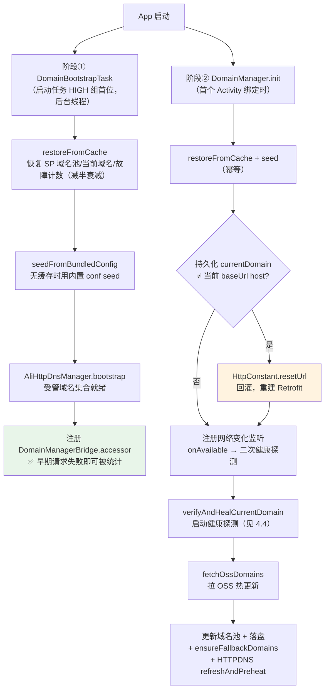
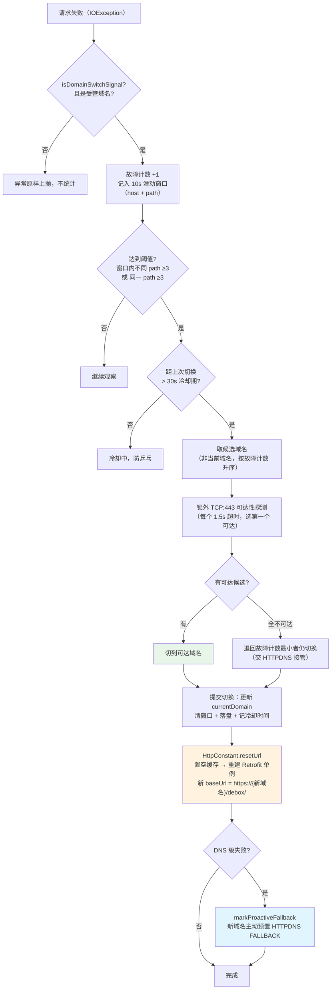
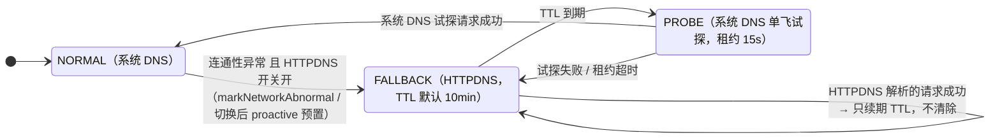
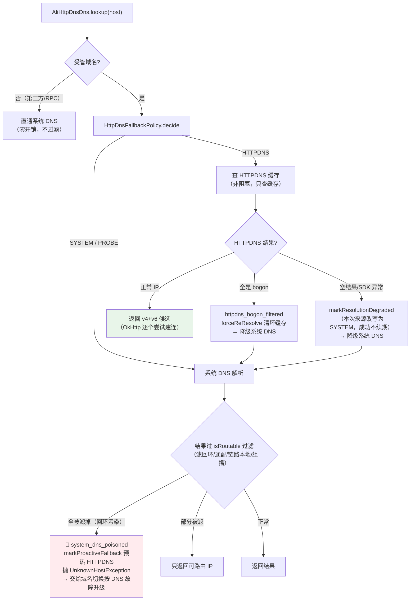
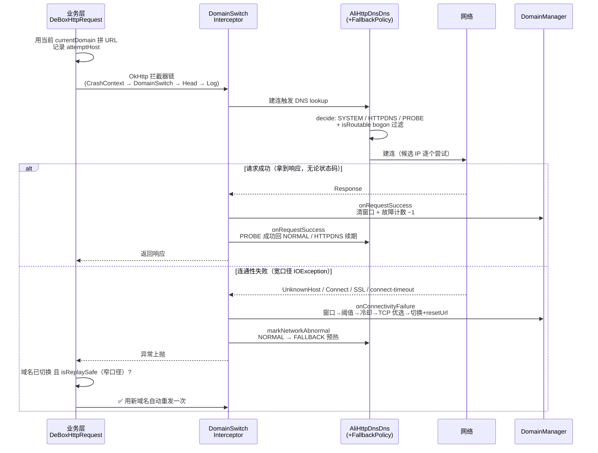
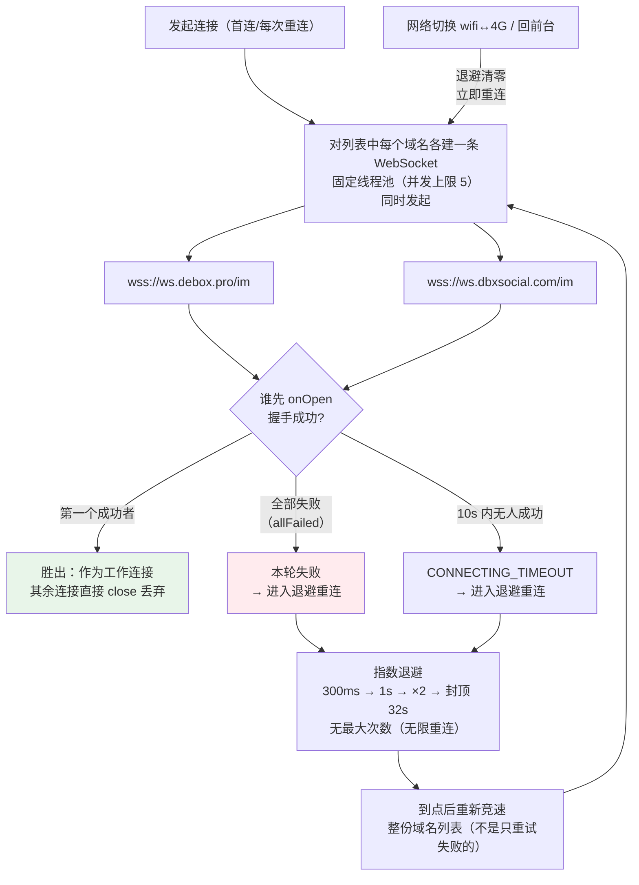

# DeBox 网络域名容灾方案 — 域名拉取 / 动态切换 / HTTPDNS / IM 多域名

> 面向分享的完整方案文档。整合 debox-android 源码实现 + autotest 五轮真机测试验证。
> 日期：2026-07-13 ｜ 被测 App：DeBox（`com.tm.security.wallet`）｜ 实现仓库：debox-android ｜ 测试仓库：autotest
>
> **飞书 wiki 版**（研发部 → 产研项目集 → 大客户端，流程图为可编辑画板，对外分享用 wiki 版；本文件为仓库存档备份）：
> - 总览：https://deboxsocial.sg.larksuite.com/wiki/SMXZwuD29iaiNqkkVt5lIW7RgNg
> - 域名拉取与动态切换：https://deboxsocial.sg.larksuite.com/wiki/FlQLwX4L6i8H1tkwUvQlJulLgif
> - 阿里云 HTTPDNS 接入与回环 bogon 兜底：https://deboxsocial.sg.larksuite.com/wiki/LZgAw9KzHi5yYWksDXelT7VMg3d
> - IM 多域名容灾（JuggleIM 多 navi）：https://deboxsocial.sg.larksuite.com/wiki/YXmWwaILri6jqkkThu4lQd13gSg
> - 测试验证与关键 BUG 闭环：https://deboxsocial.sg.larksuite.com/wiki/MkLkwmTD5in4J4k7B0MlXOYdgld

---

## 目录

1. [背景：为什么需要这套方案](#一背景为什么需要这套方案)
2. [总体架构：三道防线](#二总体架构三道防线)
3. [域名拉取：域名池从哪来](#三域名拉取域名池从哪来)
4. [域名动态切换：怎么切、何时切](#四域名动态切换怎么切何时切)
5. [HTTPDNS：阿里云 EMAS 接入与三态状态机](#五httpdns阿里云-emas-接入与三态状态机)
6. [回环/bogon 兜底：真实工单驱动的补丁](#六回环bogon-兜底真实工单驱动的补丁)
7. [一次 API 请求的完整链路](#七一次-api-请求的完整链路)
8. [IM 多域名：JuggleIM 并发竞速](#八im-多域名juggleim-并发竞速)
9. [测试验证：五轮演进与关键 BUG 闭环](#九测试验证五轮演进与关键-bug-闭环)
10. [已知边界与遗留问题](#十已知边界与遗留问题)
11. [附录：关键参数速查表](#十一附录关键参数速查表)

---

## 一、背景：为什么需要这套方案

DeBox 是一款 Web3 钱包 App，海外部分地区/运营商环境下面临三类网络故障：

| 故障类型 | 表现 | 传统方案的缺口 |
|---|---|---|
| **域名被封/不可达** | 主域名 TCP 连不上、TLS 被阻断 | 单域名无备份，App 直接不可用 |
| **DNS 污染** | 系统 DNS 返回错误 IP，或解析失败（UnknownHost） | LocalDNS 不可信，换域名也可能被污染 |
| **DNS 回环黑洞** | 去广告/安全软件把域名 sinkhole 到 `127.0.0.1` / `::1` | 解析"成功"但连的是本机，**绕过所有失败检测**——真实工单：用户 16 小时 / 25 次重启彻底打不开 |

对应地，方案演进出**三道互相协作的防线**（HTTP API 两道 + IM 一道），全部在客户端自愈，无需用户干预。

---

## 二、总体架构：三道防线



**核心设计原则**：

1. **两道 HTTP 自愈互不替代、显式协作** —— 同一个连通性异常（如 `UnknownHostException`）同时驱动"域名切换"和"HTTPDNS FALLBACK"两条链路；DNS 级失败触发切换后，还会对新域名主动预置 HTTPDNS FALLBACK（防止新域名也被同一 LocalDNS 污染）。
2. **失败判定分两套口径** —— 切换用宽口径（含 SSL），请求自动重发用窄口径（排除 SSL，防 POST 重复提交）。
3. **fail-safe 默认关闭** —— HTTPDNS 密钥缺失即整体禁用；配置解析异常时收窄而非放大作用域。
4. **IM 走独立防线** —— IM WebSocket 不经过 RetrofitFactory，不受前两道保护，靠多 hostname 并发竞速绕过针对主域名的 DNS 污染。

---

## 三、域名拉取：域名池从哪来

### 3.1 四个来源与优先级

| 优先级 | 来源 | 内容 | 说明 |
|---|---|---|---|
| 1（最高） | **阿里云 OSS 远端配置** | `conf_v2.json`（正式）/ `conf_test.json`（测试）的 `hosts[]` + `httpdns` 段 | 热更新入口，拉到即覆盖并落盘 SP |
| 2 | **SP 本地缓存** | `domain_list` / `domain_current` / `domain_failures` / `httpdns_config` | 上次运行的持久化状态，启动即恢复 |
| 3 | **内置兜底配置文件** | APK 内 `res/raw/httpdns_conf_v2_fallback.json` | 仅"从未拉到过 OSS/SP"时 seed（新装机坏网场景） |
| 恒定注入 | **代码内置兜底域名** | `["debox.pro", "dbxsocial.com"]` | `ensureFallbackDomains()` **始终**并入域名池，保证切换永远有备选 |

> 另有 sysConfig 接口下发的 `host` 列表，存入 `extraDomains`——**只用于 WebView 白名单等场景，不参与故障切换**。

### 3.2 启动两阶段初始化

早期版本存在一个问题：App 启动最初几个请求失败时，域名切换组件还没注册（`domain_accessor_null`），失败被白白丢弃。07-01 补丁把初始化拆成两阶段：



> **阶段② 第 C2/C3 步是 06-25 修复的关键 BUG**：此前持久化的 `currentDomain`（如已切到 `dbxsocial.com`）在重启后**不回灌** base URL，主 API 仍打旧域名（实测 100:4）。修复后翻转为新域名占主（102:14）。副作用是切换跨启动"粘住"、不自动回主域名——是否"重启优先试主域名"属产品决策项。

---

## 四、域名动态切换：怎么切、何时切

### 4.1 触发口径：什么算"连通性故障"

由 OkHttp 拦截器 `DomainSwitchInterceptor` 捕获，判定函数 `NetworkFailures.isDomainSwitchSignal`（**宽口径**）：

| 异常 | 含义 | 计入切换 | 允许自动重发（窄口径） |
|---|---|---|---|
| `UnknownHostException` | DNS 解析失败/污染 | ✅（且标记 DNS 级失败） | ✅ |
| `ConnectException` / `NoRouteToHostException` | TCP 连不上 | ✅ | ✅ |
| `SSLException` | TLS 握手失败（证书劫持/阻断） | ✅ | ❌（请求可能已送达，防 POST 重复提交） |
| `SocketTimeoutException`（**仅 connect 阶段**） | 建连超时 | ✅ | ✅ |
| read/write 超时 | 服务端慢，不是链路问题 | ❌ | ❌ |
| HTTP 4xx/5xx | 拿到响应=链路通 | ❌（反而回报成功） | ❌ |

只对**受管域名**（当前域名 / OSS 池 / 内置兜底）统计——第三方 RPC、DApp 域名的失败不污染主域名切换。

### 4.2 切换决策：滑动窗口 + 冷却期 + TCP 可达优选



**关键参数**：窗口 10s ｜ distinct-path 阈值 3 ｜ same-path 阈值 3（单接口页面兜底）｜ 冷却期 30s ｜ 探测超时 1.5s/个。

### 4.3 请求层自动重发（对用户无感）

切换发生在拦截器层，但**触发切换的那个请求本身已经失败了**。`DeBoxHttpRequest.call` 在异常回调里补一刀：

- 条件：域名已被自愈切换（当前 host ≠ 本次尝试的 host）**且** 异常属窄口径 `isReplaySafe` **且** 不是完整 URL 请求 **且** 本请求未重发过；
- 动作：用新域名**自动重发一次**（每请求至多一次）。
- 效果：用户点一下就成功，感知不到背后换了域名。

### 4.4 健康探测与恢复（切出去，还要能自愈回来）

| 机制 | 触发时机 | 行为 |
|---|---|---|
| **启动健康探测** | App 启动（`startup`） | 后台线程 TCP 探测当前域名:443；不可达且有可达备选→切；**全不可达（疑似离线）→保留当前域名不动**（避免误清已生效的切换，06-13 OBS-01 修复） |
| **网络变化二次探测** | `NetworkCallback.onAvailable`（如 WiFi↔蜂窝） | 再跑一次同样的健康探测（loop-drain 防并发堆积） |
| **成功衰减** | 任一受管请求成功 | 清空失败窗口 + 当前域名故障计数 −1（仅当成功 host == 当前域名） |
| **启动衰减** | 每次冷启动 | 持久化故障计数**减半**（实测 15→7→3），历史故障不永久拉黑域名 |

---

## 五、HTTPDNS：阿里云 EMAS 接入与三态状态机

### 5.1 接入方式

- SDK：`com.aliyun.ams:alicloud-android-httpdns:2.6.9`，密钥经 `local.properties`/环境变量注入 BuildConfig（缺密钥→整体禁用，fail-safe）。
- 挂载点：`RetrofitFactory` 构建 OkHttp 时 `.dns(AliHttpDnsDns())` —— 实现 `okhttp3.Dns` 接口，对上层业务零侵入。
- **懒初始化**：默认走系统 DNS；只有开关评估为 true 才在后台线程 init SDK（init 期间的预解析请求挂起，完成后补发）。
- **开关评估**：`密钥就绪 && (debug 强制 || (OSS 配置 enabled && 灰度分桶命中))`；生效域名 = 受管域名 ∩ OSS `hosts` 收窄列表。
- 缓存：SDK 本地缓存 IP 1 小时，允许乐观使用过期 IP，网络变化后自动重解析；启动/热更新/进入 FALLBACK 时预解析受管域名。

### 5.2 per-host 三态状态机（核心防震荡设计）

**不是"一直用 HTTPDNS"**，而是平时走系统 DNS（零成本、零计费），出事才切，且带试探性回切：



**来源感知原则**（防"假恢复"震荡）：只有 **PROBE 态用系统 DNS 试探成功**才回 NORMAL；FALLBACK 期间用 HTTPDNS 成功只续期。若 HTTPDNS 返回空结果被迫降级系统 DNS，该次成功**不算 HTTPDNS 的功劳、不续期**——避免 EMAS 控制台漏配域名时状态机卡死。

### 5.3 DNS 解析决策全景（含 bogon 兜底）



---

## 六、回环/bogon 兜底：真实工单驱动的补丁

**工单现象**：用户手机装了去广告/安全类软件，系统 DNS 把 `debox.pro` 和 `ws.debox.pro` sinkhole 到回环地址（`::1` / `127.0.0.1`）。此时 DNS 解析是"成功"的——不抛 UnknownHost、不触发任何既有自愈——App 只是不停地连本机 `127.0.0.1` 失败，两套自愈机制全部被绕过，16 小时 / 25 次重启打不开。

**补丁核心不变量**（07-01，`AliHttpDnsDns.isRoutable`）：

> 受管公网域名解析出的回环（`127.0.0.0/8`、`::1`）、通配（`0.0.0.0`、`::`）、链路本地（`169.254/16`、`fe80::`）、组播地址，**一律不交给 OkHttp 建连**，改为**抛 `UnknownHostException`**——把"隐形黑洞"翻译成既有自愈体系认识的"DNS 故障"，让域名切换 + HTTPDNS FALLBACK 正常接管。

真机实证链（可 root 模拟器 + 自建 DNS 响应器注入 `::1`）：

```
system_dns_poisoned: debox.pro raw=1 addrs=[::1]        ← 识别污染
→ 抛 UnknownHostException（connect 埋点回环 0 条，未连过本机）
→ enter_fallback（HTTPDNS 升级）
→ 域名切换 debox.pro -> dbxsocial.com (可达优选)          ← 完整升级链闭环
```

同批次还加了 `NetEventListener` 连接级诊断埋点（受管域名逐请求记录解析 IP / 建连 IP / 错误类，无 PII），以后此类工单可直接从日志定位。

---

## 七、一次 API 请求的完整链路

把前面所有机制串起来，一次请求从发起到失败自愈的全过程：



---

## 八、IM 多域名：JuggleIM 并发竞速

### 8.1 为什么 IM 需要单独一道防线

IM 用 JuggleIM SDK 的 WebSocket 长连接（`wss://`），**不经过 RetrofitFactory**——前两道防线（域名切换、HTTPDNS）都保护不到它。06-13 测试实测过这个边界：DNS 污染期间 HTTP 业务请求靠 HTTPDNS 全部 200，但 IM 顶栏一直"连接中"。这正是回环工单里 IM 永久重连失败的成因，推动了多 navi 改造（07-01 P0-C3）。

### 8.2 配置与解析

- 编译期配置（`local.properties` → BuildConfig），逗号/分号分隔，运维加域名无需改代码：
  - 生产：`wss://ws.debox.pro, wss://ws.dbxsocial.com`（主 + 备**不同 hostname**，绕过按 hostname 的 DNS 污染）
  - 测试：`wss://im-s.debox.pro`
- `AppConstant.getAppNaviListForJ()` 解析：拆分 → trim → 去空 → 去重 → 保序 → `JIM.setServerUrls(list)`。

### 8.3 容灾机制：不是逐个尝试，是并发竞速

读 JuggleIM 1.8.47.1 源码（`JWebSocket.connect`）确认：



要点：

- **主域名被 DNS 黑洞时**：主的那条连接失败，备域名那条并发连接自然胜出——failover 不依赖"感知主坏了再换"，天然完成。
- **每次重连都重新竞速全部域名**：网络恢复后主备重新竞争，无需显式"回切"逻辑。
- **心跳兜底**：每 10s ping、20s 收不到任何消息判定超时 → 走重连流程。
- **鉴权类错误不重试**：服务端返回含 `403` 的关闭原因 → `CONNECT_FORBIDDEN`，终止重连（避免风暴）。
- **IM 仍走系统 DNS**：本轮只做多 hostname（P0-C3 ①），IM 未接 HTTPDNS（②③ 留作后续补强）。

### 8.4 BUG-002：备用域名为什么一度切不过去（重要案例）

真机验证时发现主域名黑洞后备用 `ws.dbxsocial.com` 切不过去。四步定位（agent-dev-loop + Codex 独立 review）：

| Track | 假设 | 结论 |
|---|---|---|
| A 读 SDK 源码 | "SDK 不会轮换备用" | ❌ 证伪——并发竞速机制健全，备用被真实尝试 |
| B 真机复核 DNS | 备用是否真异线路 | 🔴 备用曾是主域名的 **CNAME 同源**（同 IP）——形同虚设 |
| C 证书 | 运维改独立站点后 | 🔴 备用域名**未绑证书**（回落 `*.cdn.myqcloud.com`）→ TLS 握手失败，先于一切 WS 逻辑 |
| D WS 路由 | 证书修复后 | 🔴 WS 握手被 **400**——EdgeOne 站点没把 WS 路由到 IM 网关 |

**收口**：客户端机制无缺陷；阻断全在服务端/运维侧。证书（07-01 22:08）+ WS 路由（07-02 ~10:45）两处修复后，真机"死主 + 真备"复测 `onOpen` 闭环 ✅。教训：**多域名容灾的有效性必须端到端验收（DNS→证书→路由→业务），不能只看客户端配置**。

---

## 九、测试验证：五轮演进与关键 BUG 闭环

### 9.1 五轮测试演进（autotest 仓库，AI 驱动真机测试）

| 轮次 | 主题 | 规模 | 关键产出 |
|---|---|---|---|
| **06-12** 阿里云 HTTPDNS 接入 | 四层验证（静态/单测/集成/真机），8 轮迭代 | 67 条用例 | 🔴 **BUG-001**：OSS 配置格式契约不匹配，HTTPDNS 静默失效（已修复回归） |
| **06-13** 域名动态切换 | 内置兜底池 + 启动健康探测 | 26 条 | 🟡 **OBS-01**：离线重启误清已切域名（已修复：全不可达保留当前域名） |
| **06-23** 深度测试 | 密钥激活后首次全链路真机实测 | 81 自动化 + 25 真机 | HTTPDNS happy 路径生产域名实测 PASS；厘清注入手段边界 |
| **06-25** 自愈鲁棒性增强 | 对抗性分析后 9+1 项加固 | A13+B6+D10 | 🔴 持久化域名不回灌 base URL（已修复，100:4→102:14 翻转验证） |
| **07-01** 回环 bogon 兜底 + IM 多 navi | 真实工单驱动 | 50 条 | 回环兜底全链路闭环；**BUG-002** IM 备用域名四步定位（运维两项修复） |

### 9.2 关键测试结论

1. **域名切换全链路真机验证通过**：滑动窗口阈值触发、30s 冷却防乒乓、TCP 可达优选（实测日志 `域名切换 debox.pro -> dbxsocial.com (可达优选)`）、故障计数启动衰减（15→7→3）、自动重发（`自动重发: dapps/check_token_channel`）。
2. **HTTPDNS happy 路径生产实测**：DNS 污染期间 `httpdns_hit: debox.pro ip_count=2`，业务请求持续 200。
3. **回环兜底实测**：注入 `::1` 污染后 connect 埋点回环 0 条，完整升级链（poisoned → UnknownHost → FALLBACK → 切域名）闭环。
4. **IM 竞速实测**：死主（`wss://127.0.0.1`）+ 真备场景，备用被并发尝试并 `onOpen` 胜出。
5. **方法论教训**："全绿"多次被真实配置/真实工单打破——BUG-001 是拿真实线上 OSS 配置核对才暴露的（测试用的模拟配置是嵌套格式，线上是扁平格式）；回环场景是真实工单驱动的。**测试数据必须对齐真实生产物料**。

### 9.3 值得一讲的 BUG：BUG-001（HTTPDNS 静默失效）

- 线上 OSS 配置用扁平字段（`httpdns_enabled`、`httpdns_hosts`），代码只解析嵌套 `httpdns` 对象 → 解析不到按"段缺失"处理，沿用默认 `enabled=false` → **HTTPDNS 在最需要它的时候静默失效，线上无任何报错**。
- 根因：方案文档正文用扁平字段名描述语义，配置人员照文档配置，漏了"实际需嵌套"的约定。
- 修复：解析器兼容两种格式（嵌套优先、扁平回退、标准化持久化），并在生产环境回归验证。
- 附带发现 OSS 侧 `ttl_ms: 600`（应为 600000，漏 3 个 0，600ms 导致状态机频繁翻转）。

---

## 十、已知边界与遗留问题

### 设计内边界（非缺陷）

| 边界 | 说明 |
|---|---|
| read 超时不触发切换 | 读写超时=服务端慢，不是链路故障；仅 connect 超时计入 |
| SSL 失败可切换但不自动重发 | 请求可能已送达，POST 防重复提交 |
| TCP 可达 ≠ 业务可用 | 可达优选只探 TCP:443，TCP 通但 TLS 被断的场景会误选（已实证，接受该权衡——后续 HTTPDNS/请求级切换会接管） |
| 完整 URL 请求不享受自动重发 | 如启动期 sysConfig 等 full-URL 请求 |
| 切换跨启动"粘住" | 不自动回主域名；"重启优先试主"待产品决策 |

### 遗留待办

1. **覆盖盲区**：AI 代理（`AiProxyService` 裸 OkHttpClient）和 RN 通道完全在容灾体系外——无切换、无 HTTPDNS、无自动重发。建议复用 `RetrofitFactory` 的 client。
2. **IM 未接 HTTPDNS**（P0-C3 ②③）：`ws.debox.pro` 不在 `httpdns_hosts`，主备同时被污染时 IM 无解。Codex review 建议补强（HTTPDNS 或兜底 IP 直连）。
3. **运维项**：测试环境 `t.debox.pro` 未托管进 EMAS 控制台（测试环境 HTTPDNS 正向路径无法验证）；IM 备用域名与主域名仍同属 EdgeOne 平台，防 hostname 污染有效、防平台级故障无冗余。

---

## 十一、附录：关键参数速查表

### 域名切换（DomainManager）

| 参数 | 值 |
|---|---|
| 滑动窗口 | 10s |
| 切换阈值 | 窗口内不同 path ≥3，或同一 path ≥3 |
| 冷却期 | 30s |
| 切换前 TCP 探测 | 端口 443，超时 1.5s/个 |
| 启动故障计数衰减 | 减半 |
| 内置兜底域名 | `debox.pro`、`dbxsocial.com` |
| SP 键 | `domain_list` / `domain_current` / `domain_failures` / `httpdns_config` |

### HTTPDNS（阿里云 EMAS 2.6.9）

| 参数 | 值 |
|---|---|
| SDK 解析超时 | 2s |
| SDK 本地缓存 | 1h（允许乐观过期 IP） |
| FALLBACK TTL | 默认 10min（OSS 可配 `httpdns_abnormal_ttl_ms`） |
| PROBE 租约 | 15s |
| 灰度默认 | 100%（`Math.floorMod(deviceId.hashCode(),100) < percent`） |
| 传输 | HTTPS 开、AES 关（默认） |

### OkHttp（RetrofitFactory）

| 参数 | 值 |
|---|---|
| connect / read / write 超时 | 10s / 30s / 30s |
| 拦截器顺序 | CrashContext → DomainSwitch → Head → Log |
| 其他 | `.dns(AliHttpDnsDns)`、`.proxy(NO_PROXY)`、`.eventListenerFactory(NetEventListener)`、`retryOnConnectionFailure(true)` |

### IM（JuggleIM 1.8.47.1）

| 参数 | 值 |
|---|---|
| 生产 navi | `wss://ws.debox.pro`、`wss://ws.dbxsocial.com`（并发竞速） |
| 竞速并发上限 | 5 |
| 连接超时 | 10s |
| 重连退避 | 300ms → 1s → ×2 → 封顶 32s，无限重连 |
| 心跳 | 10s ping，20s 无消息判超时 |
| WS 路径 | 域名后拼 `/im` |
| DNS | 系统 DNS（未接 HTTPDNS） |

### 关键源码位置（debox-android）

| 职责 | 文件 |
|---|---|
| 域名池/切换/健康探测 | `business/BaseModule/.../module/DomainManager.kt` |
| 切换拦截器 | `business/BaseBusiness/.../http/intercepter/DomainSwitchInterceptor.kt` |
| 失败口径 | `business/BaseBusiness/.../http/NetworkFailures.kt` |
| HTTPDNS 封装/Dns 适配/状态机 | `business/BaseBusiness/.../network/httpdns/`（`AliHttpDnsManager` / `AliHttpDnsDns` / `HttpDnsFallbackPolicy` / `HttpDnsConfig` / `HttpDnsRemoteConfig`） |
| 请求层重发 | `business/BaseBusiness/.../network/request/DeBoxHttpRequest.kt` |
| 早期引导任务 | `app/.../startup/tasks/HighPriorityTasks.kt`（DomainBootstrapTask） |
| IM 多 navi | `business/BaseBusiness/.../AppConstant.kt`（`getAppNaviListForJ`）、`im/imKit/.../jetim/DBXJimCenter.java` |
| 内置兜底配置 | `business/BaseModule/src/main/res/raw/httpdns_conf_v2_fallback.json` |

### 测试记录位置（autotest）

| 轮次 | 目录 |
|---|---|
| HTTPDNS 接入 | `docs/testing/runs/2026-06-12-阿里云HTTPDNS/` |
| 域名动态切换 | `docs/testing/runs/2026-06-13-域名动态切换/` |
| 深度测试 | `docs/testing/runs/2026-06-23-域名HTTPDNS深度测试/` |
| 自愈鲁棒性增强 | `docs/testing/runs/2026-06-25-域名HTTPDNS自愈鲁棒性增强/` |
| 回环兜底 + IM 多 navi | `docs/testing/runs/2026-07-01-HTTPDNS回环bogon兜底/` |
| 机制知识库 | `docs/testing/app-knowledge/network-domain.md` |
