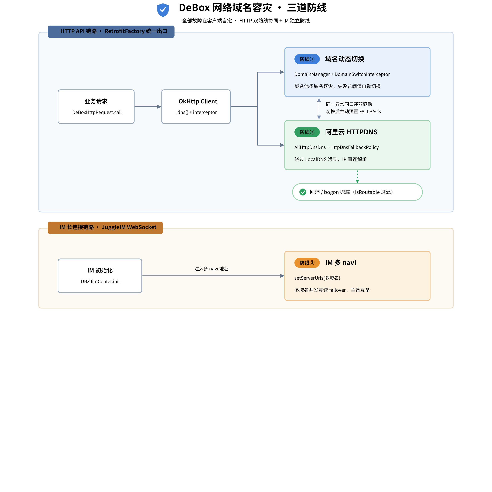
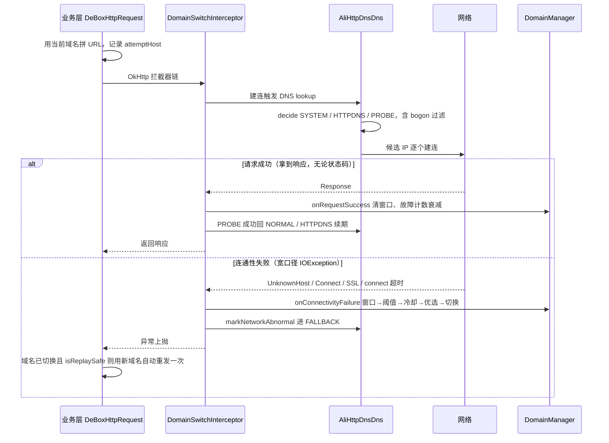

# 

> 飞书 wiki 原文：https://deboxsocial.sg.larksuite.com/wiki/SMXZwuD29iaiNqkkVt5lIW7RgNg （本文件为 2026-07-13 导出的本地备份，流程图为画板导出 PNG）

# 一、背景

DeBox 是一款 Web3 钱包 App，海外部分地区和运营商环境下长期面临网络层故障，任何一类都可能让 App 完全打不开。这套方案的目标是：**全部故障在客户端自愈，不需要用户做任何操作**。

| 故障类型 | 表现 | 传统方案的缺口 |
|-|-|-|
| 域名被封 / 不可达 | 主域名 TCP 连不上、TLS 被阻断 | 单域名无备份，App 直接不可用 |
| DNS 污染 | 系统 DNS 返回错误 IP，或解析失败（UnknownHost） | LocalDNS 不可信，换域名也可能被同一 DNS 污染 |
| DNS 回环黑洞 | 去广告 / 安全软件把域名 sinkhole 到 127.0.0.1 / ::1 | 解析"成功"但连的是本机，绕过所有失败检测 |

第三类来自一个真实工单：用户手机装了去广告类软件，系统 DNS 把 debox.pro 和 ws.debox.pro 都解析到回环地址。此时 DNS 解析是"成功"的——不抛异常、不触发任何既有自愈——App 只是不停地连本机失败，用户 16 小时内重启 25 次仍然打不开。这个工单直接推动了回环兜底补丁和 IM 多域名改造。

# 二、总体架构：三道防线

HTTP API 链路（RetrofitFactory 统一出口）上有两道防线：**防线① 域名动态切换**（DomainManager + DomainSwitchInterceptor，域名池多域名容灾）和**防线② 阿里云 HTTPDNS**（AliHttpDnsDns + HttpDnsFallbackPolicy，绕过 LocalDNS 污染，附带回环/bogon 过滤）。IM 走 JuggleIM WebSocket 长连接，不经过 RetrofitFactory，前两道保护不到，因此有独立的**防线③ IM 多 navi**（多域名并发竞速 failover）。

几条贯穿全局的设计原则：

**两道 HTTP 自愈互不替代、显式协作。**同一个连通性异常（如 UnknownHostException）会同时驱动"域名切换"和"HTTPDNS FALLBACK"两条链路；DNS 级失败触发域名切换后，还会对新域名主动预置 HTTPDNS FALLBACK——因为新域名很可能被同一个 LocalDNS 污染。

**失败判定分两套口径。**切换用宽口径（含 SSL 异常），请求自动重发用窄口径（排除 SSL）——SSL 失败时请求可能已送达服务端，自动重发有 POST 重复提交风险。

**fail-safe 默认关闭。**HTTPDNS 密钥缺失即整体禁用；远端配置解析异常时收窄而非放大作用域。

# 三、一次 API 请求的完整链路

把所有机制串起来，一次请求从发起、DNS 决策、到失败自愈的全过程如下：

拦截器顺序为 CrashContext → DomainSwitch → Head → Log，另注入 .dns(AliHttpDnsDns)、.proxy(NO_PROXY)、连接级诊断埋点 NetEventListener。超时配置：connect 10s / read 30s / write 30s。

一个容易误解的点：**切换与 HTTP 状态码无关**。只要拿到 Response（无论 4xx/5xx）都视为链路连通，反而会回报成功、衰减故障计数——4xx/5xx 是业务问题，不是链路问题。

# 四、设计边界与遗留问题

以下是刻意的设计取舍，不是缺陷：

| 边界 | 原因 |
|-|-|
| read 超时不触发切换 | 读写超时是服务端慢，不是链路故障；仅 connect 阶段超时计入 |
| SSL 失败可切换但不自动重发 | 请求可能已送达，防 POST 重复提交 |
| TCP 可达 ≠ 业务可用 | 切换前可达优选只探 TCP:443，TCP 通但 TLS 被断的场景会误选（已实测确认，接受该权衡——后续 HTTPDNS / 请求级切换会接管） |
| 完整 URL 请求不享受自动重发 | 如启动期 sysConfig 等 full-URL 请求，域名不由 DomainManager 管理 |
| 切换跨启动"粘住" | 持久化的切换选择重启后继续生效，不自动回主域名；"重启优先试主域名"属产品决策项 |

遗留待办按优先级：一是**覆盖盲区**——AI 代理（AiProxyService 裸 OkHttpClient）和 RN 通道完全在容灾体系外，无切换、无 HTTPDNS、无自动重发，建议复用 RetrofitFactory 的 client；二是 **IM 未接 HTTPDNS**——ws.debox.pro 不在 httpdns_hosts，主备域名同时被污染时 IM 无解，Codex review 建议补强；三是**运维项**——测试环境 t.debox.pro 未托管进 EMAS 控制台，且 IM 备用域名与主域名仍同属 EdgeOne 平台，防 hostname 污染有效、防平台级故障无冗余。

# 五、关键参数速查

<table><colgroup><col/><col/><col/></colgroup><thead><tr><th vertical-align="top">模块</th><th vertical-align="top">参数</th><th vertical-align="top">值</th></tr></thead><tbody><tr><td rowspan="4" vertical-align="top">域名切换</td><td vertical-align="top">滑动窗口 / 冷却期</td><td vertical-align="top">10s / 30s</td></tr><tr><td vertical-align="top">切换阈值</td><td vertical-align="top">窗口内不同 path ≥3，或同一 path ≥3</td></tr><tr><td vertical-align="top">切换前 TCP 探测</td><td vertical-align="top">端口 443，超时 1.5s/个</td></tr><tr><td vertical-align="top">内置兜底域名</td><td vertical-align="top">debox.pro、dbxsocial.com</td></tr><tr><td rowspan="3" vertical-align="top">HTTPDNS</td><td vertical-align="top">SDK 解析超时 / 本地缓存</td><td vertical-align="top">2s / 1h（允许乐观过期 IP）</td></tr><tr><td vertical-align="top">FALLBACK TTL / PROBE 租约</td><td vertical-align="top">默认 10min / 15s</td></tr><tr><td vertical-align="top">灰度默认</td><td vertical-align="top">100%（deviceId hash 分桶）</td></tr><tr><td rowspan="2" vertical-align="top">OkHttp</td><td vertical-align="top">超时</td><td vertical-align="top">connect 10s / read 30s / write 30s</td></tr><tr><td vertical-align="top">拦截器顺序</td><td vertical-align="top">CrashContext → DomainSwitch → Head → Log</td></tr><tr><td rowspan="4" vertical-align="top">IM（JuggleIM）</td><td vertical-align="top">生产 navi</td><td vertical-align="top">wss://ws.debox.pro、wss://ws.dbxsocial.com</td></tr><tr><td vertical-align="top">竞速并发上限 / 连接超时</td><td vertical-align="top">5 / 10s</td></tr><tr><td vertical-align="top">重连退避</td><td vertical-align="top">300ms → 1s → ×2 → 封顶 32s，无限重连</td></tr><tr><td vertical-align="top">心跳</td><td vertical-align="top">10s ping，20s 无消息判超时</td></tr></tbody></table>

# 六、子文档

各防线的实现细节与测试验证记录见子文档：

- [域名拉取与动态切换](01-域名拉取与动态切换.md)
- [阿里云 HTTPDNS 接入与回环 bogon 兜底](02-阿里云HTTPDNS接入与回环bogon兜底.md)
- [IM 多域名容灾（JuggleIM 多 navi）](03-IM多域名容灾-JuggleIM多navi.md)
- [测试验证与关键 BUG 闭环](04-测试验证与关键BUG闭环.md)
