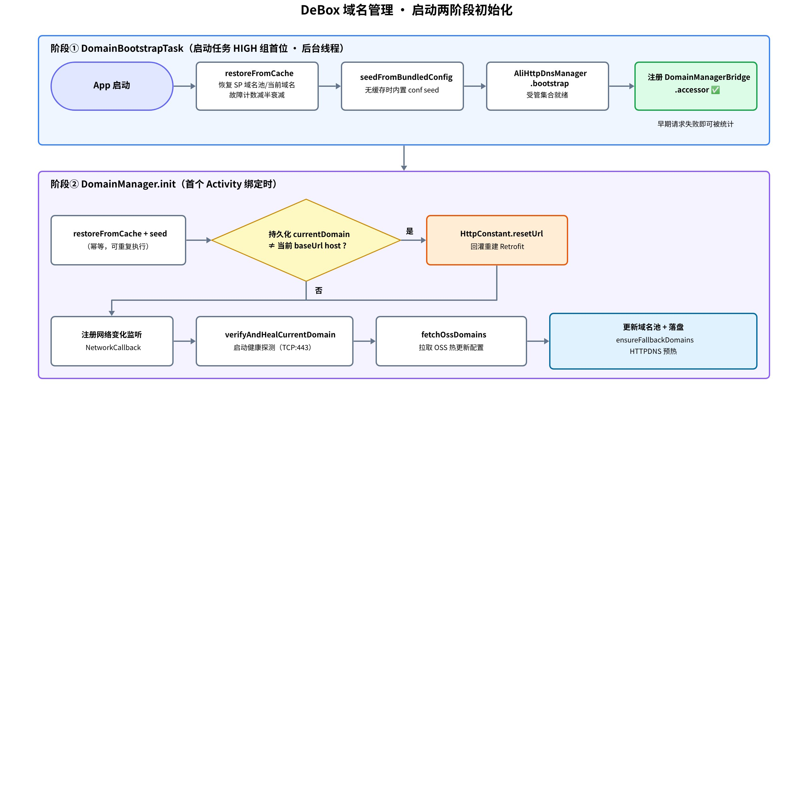
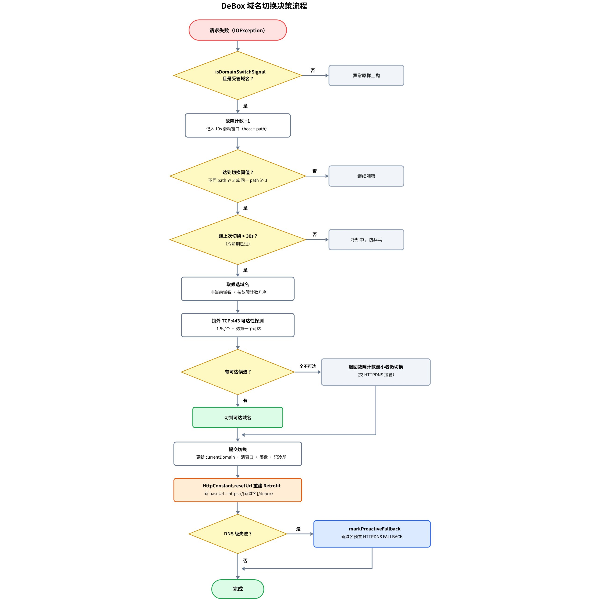

# 

> 飞书 wiki 原文：https://deboxsocial.sg.larksuite.com/wiki/FlQLwX4L6i8H1tkwUvQlJulLgif （本文件为 2026-07-13 导出的本地备份，流程图为画板导出 PNG）

# 一、域名池的来源与优先级

域名池由 DomainManager 统一管理，有四个来源，按覆盖优先级从高到低：

| 优先级 | 来源 | 说明 |
|-|-|-|
| 1（最高） | 阿里云 OSS 远端配置 | conf_v2.json（正式）/ conf_test.json（测试）的 hosts 数组 + httpdns 段。热更新入口，拉到即覆盖并落盘 SP |
| 2 | SP 本地缓存 | 键：domain_list / domain_current / domain_failures / httpdns_config。上次运行的持久化状态，启动即恢复 |
| 3 | 内置兜底配置文件 | APK 内 res/raw/httpdns_conf_v2_fallback.json，仅"从未拉到过 OSS/SP"时 seed（新装机坏网场景） |
| 恒定注入 | 代码内置兜底域名 | debox.pro、dbxsocial.com。ensureFallbackDomains() 始终并入域名池，保证切换永远有备选 |

另有 sysConfig 接口下发的 host 列表，存入 extraDomains——只用于 WebView 白名单等场景，**不参与故障切换**，避免业务域名污染容灾池。

# 二、启动两阶段初始化

早期版本有个隐蔽问题：App 启动最初几个请求失败时，域名切换组件还没注册（日志表现为 domain_switch_skip reason=domain_accessor_null），失败被白白丢弃。修复方式是把初始化拆成两阶段：**阶段①** DomainBootstrapTask 在启动任务 HIGH 组首位、后台线程执行，只做同步子集（恢复缓存、内置 seed、HTTPDNS 受管集合就绪、注册 accessor），让最早的请求失败就能被统计；**阶段②** 首个 Activity 绑定时执行完整 init（回灌 base URL、注册网络监听、健康探测、拉 OSS 热更新）。

<callout emoji="❗">
阶段②里"持久化 currentDomain 与当前 baseUrl 不一致时回灌 resetUrl"这一步，是一次真实回归修复：此前已切换并持久化的域名（如 dbxsocial.com）重启后不回灌 base URL，主 API 仍打旧域名（实测请求分布 100:4）；修复后翻转为新域名占主（102:14）。副作用是切换跨启动"粘住"、不自动回主域名。
</callout>

# 三、什么算连通性故障

由 OkHttp 拦截器 DomainSwitchInterceptor 捕获，只对**受管域名**（当前域名 / OSS 池 / 内置兜底）统计——第三方 RPC、DApp 域名的失败不污染主域名切换。判定分两套口径：

| 异常 | 含义 | 计入切换（宽口径） | 允许自动重发（窄口径） |
|-|-|-|-|
| UnknownHostException | DNS 解析失败 / 污染 | ✅（且标记 DNS 级失败） | ✅ |
| ConnectException / NoRouteToHostException | TCP 连不上 | ✅ | ✅ |
| SSLException | TLS 握手失败（劫持 / 阻断） | ✅ | ❌ 请求可能已送达，防 POST 重复提交 |
| SocketTimeoutException（仅 connect 阶段） | 建连超时 | ✅ | ✅ |
| read / write 超时 | 服务端慢，不是链路问题 | ❌ | ❌ |
| HTTP 4xx / 5xx | 拿到响应 = 链路通 | ❌（回报成功） | ❌ |

# 四、切换决策算法

核心思路是"滑动窗口 + 冷却期 + TCP 可达优选"：失败先累计进 10 秒滑动窗口（按 host + path 记录）；窗口内不同 path 失败数达到 3（多接口同坏），或同一 path 连续失败 3 次（单接口页面兜底），才进入切换判定；距上次切换不足 30 秒则处于冷却期，直接放弃本次切换，防止乒乓；通过判定后取候选域名（非当前域名，按故障计数升序），在锁外对候选逐个做 TCP:443 可达性探测（每个 1.5 秒超时），选第一个可达的切过去；全部不可达时退回故障计数最小者仍然切换——把后续机会交给 HTTPDNS 接管。

切换的落地方式是**重建 Retrofit，而不是拦截器改写 URL**：提交切换后调 HttpConstant.resetUrl()，置空缓存并重建整个 Retrofit 单例，新 baseUrl 为 https://{新域名}/debox/。若本次是 DNS 级失败触发的切换，还会对新域名调 markProactiveFallback，主动预置 HTTPDNS FALLBACK（详见 HTTPDNS 子文档）。

# 五、请求层自动重发

切换发生在拦截器层，但触发切换的那个请求本身已经失败了。DeBoxHttpRequest.call 在异常回调里补一刀：若域名已被自愈切换（当前 host ≠ 本次尝试的 attemptHost）、异常属窄口径 isReplaySafe、不是完整 URL 请求、且本请求未重发过，则用新域名**自动重发一次**（每请求至多一次）。效果是用户点一下就成功，感知不到背后换了域名。真机实测日志：「域名已自愈切换(debox.pro -> dbxsocial.com)，自动重发: dapps/check_token_channel」。

# 六、健康探测与恢复

切出去之后还要能自愈回来，恢复侧有四个机制：

| 机制 | 触发时机 | 行为 |
|-|-|-|
| 启动健康探测 | App 启动 | 后台线程 TCP 探测当前域名:443；不可达且有可达备选→切；**全不可达（疑似离线）→保留当前域名不动**，避免误清已生效的切换选择 |
| 网络变化二次探测 | NetworkCallback.onAvailable（如 WiFi↔蜂窝） | 再跑一次同样的健康探测，loop-drain 防并发堆积 |
| 成功衰减 | 任一受管请求成功 | 清空失败窗口 + 当前域名故障计数减一（仅当成功 host 等于当前域名） |
| 启动衰减 | 每次冷启动 | 持久化故障计数减半（实测 15→7→3），历史故障不永久拉黑域名 |

# 七、关键源码位置

| 职责 | 文件（debox-android） |
|-|-|
| 域名池 / 切换 / 健康探测 | business/BaseModule/.../module/DomainManager.kt |
| 切换拦截器 | business/BaseBusiness/.../http/intercepter/DomainSwitchInterceptor.kt |
| 失败口径 | business/BaseBusiness/.../http/NetworkFailures.kt |
| 请求层重发 | business/BaseBusiness/.../network/request/DeBoxHttpRequest.kt |
| 常量与桥接 | business/BaseBusiness/.../network/HttpConstant.kt |
| 早期引导任务 | app/.../startup/tasks/HighPriorityTasks.kt（DomainBootstrapTask） |
