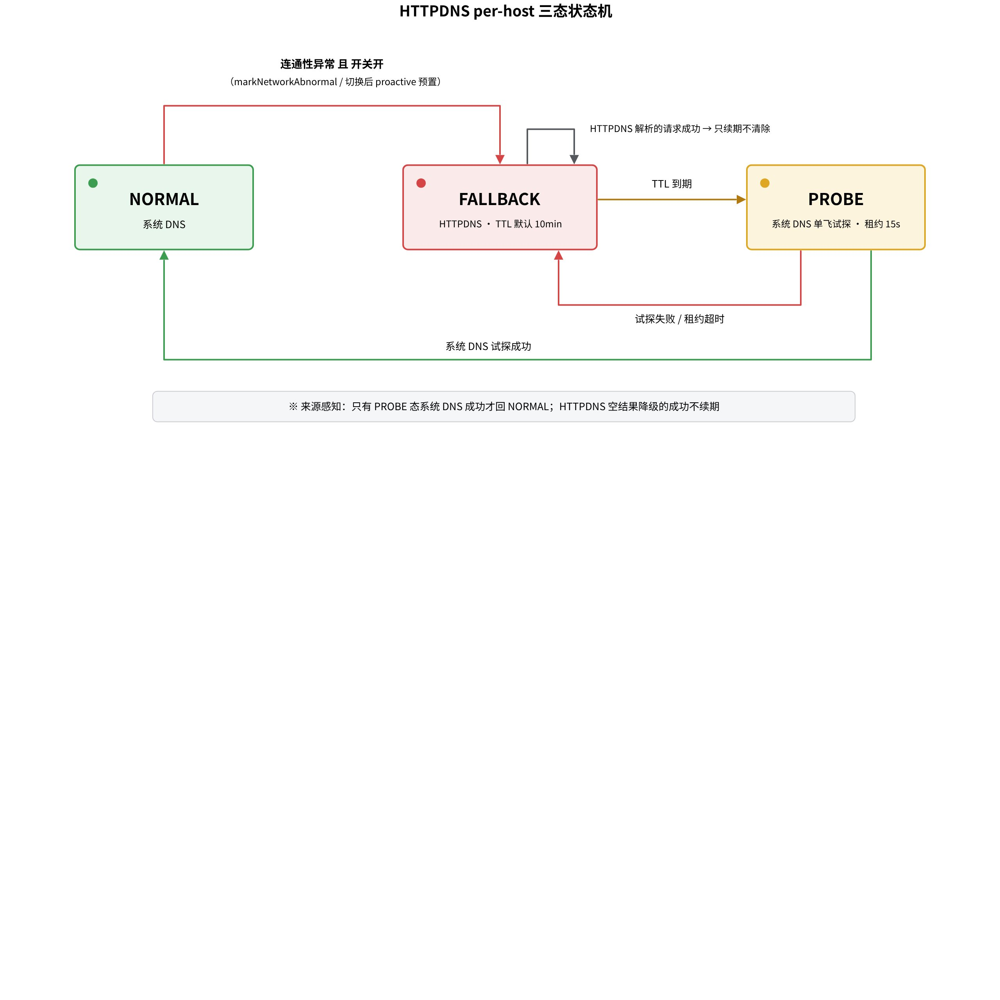
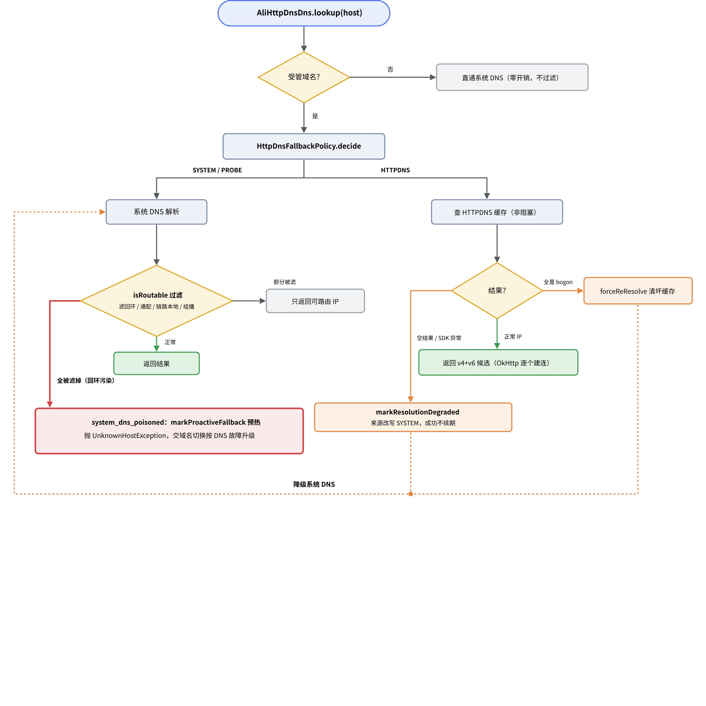

# 

> 飞书 wiki 原文：https://deboxsocial.sg.larksuite.com/wiki/LZgAw9KzHi5yYWksDXelT7VMg3d （本文件为 2026-07-13 导出的本地备份，流程图为画板导出 PNG）

# 一、接入方式

使用阿里云 EMAS HTTPDNS SDK（com.aliyun.ams:alicloud-android-httpdns:2.6.9），密钥经 local.properties / 环境变量注入 BuildConfig，缺密钥则整体禁用（fail-safe）。挂载点在 RetrofitFactory 构建 OkHttp 时注入 .dns(AliHttpDnsDns())——实现 okhttp3.Dns 接口，对上层业务零侵入。

SDK 采用**懒初始化**：平时走系统 DNS，只有开关评估为 true 才在后台线程 init（init 期间的预解析请求挂起，完成后补发）。开关评估公式：

```kotlin
hasCredentials() && (debugForce() || (enabled && grayBucketHit))
// 灰度分桶：Math.floorMod(deviceId.hashCode(), 100) < percent，默认 100%
// 生效域名 = 受管域名（内置 ∪ OSS 池）∩ OSS hosts 收窄列表
```

一个防御性细节：OSS 的 hosts 收窄列表若"配了非空但全非法"，按安全失败处理（不生效），避免误配把 HTTPDNS 作用域放大到全部受管域名。

# 二、per-host 三态状态机

这不是"一直用 HTTPDNS"的方案——平时走系统 DNS（零成本、零计费），出事才切到 HTTPDNS，且带试探性回切。每个 host 独立维护三个状态：



**NORMAL**（系统 DNS）在发生连通性异常且开关打开时进入 **FALLBACK**（HTTPDNS，TTL 默认 10 分钟）；TTL 到期进入 **PROBE**（放一个请求用系统 DNS 单飞试探，租约 15 秒）；试探成功回 NORMAL，失败重回 FALLBACK。

防"假恢复"震荡的关键是**来源感知原则**：只有 PROBE 态用系统 DNS 试探成功才回 NORMAL；FALLBACK 期间用 HTTPDNS 成功只续期 TTL、不清除状态。若 HTTPDNS 返回空结果被迫降级系统 DNS，本次解析来源被改写为 SYSTEM，该次请求成功也不给 HTTPDNS 续期——避免 EMAS 控制台漏配域名时状态机卡死在 FALLBACK 里空转。解析来源通过 ThreadLocal 逐请求传递，并用 generation 校验拦截陈旧回调。

# 三、解析决策全景与回环 bogon 兜底

AliHttpDnsDns.lookup 是所有决策的汇聚点。非受管域名（Web3 RPC、第三方）零开销直通系统 DNS；受管域名按状态机决策走系统 DNS 或 HTTPDNS，两条路径的结果都要过 isRoutable 过滤。



isRoutable 过滤规则：回环（127.0.0.0/8、::1）、通配（0.0.0.0、::）、链路本地（169.254/16、fe80::）、组播地址一律滤除；保留 site-local、NAT64/DNS64 合成地址。三个兜底分支：

| 场景 | 处理 |
|-|-|
| 系统 DNS 全部结果不可路由（回环污染） | 标记 system_dns_poisoned，markProactiveFallback 预热 HTTPDNS，**抛 UnknownHostException**——把"隐形黑洞"翻译成既有自愈体系认识的 DNS 故障，让域名切换 + FALLBACK 正常接管 |
| HTTPDNS 自身返回全 bogon | forceReResolve 清坏缓存 + 强制重解析，降级系统 DNS |
| HTTPDNS 空结果 / SDK 异常 | markResolutionDegraded（本次来源改写为 SYSTEM，成功不续期），降级系统 DNS |

这个补丁源自真实工单：用户手机上的去广告软件把域名 sinkhole 到回环，解析"成功"但连的是本机，两套自愈全部被绕过，16 小时 / 25 次重启打不开。补丁的核心不变量是：**受管公网域名解析到回环，绝不把 127.0.0.1 / ::1 交给 OkHttp 建连**。真机实证（可 root 模拟器注入 ::1 污染）的完整升级链：

```text
system_dns_poisoned: debox.pro decision=SYSTEM raw=1 addrs=[::1]   ← 识别污染
→ 抛 UnknownHostException（connect 埋点回环 0 条，从未连过本机）
→ enter_fallback（HTTPDNS 升级）
→ 域名切换 debox.pro -> dbxsocial.com (可达优选)                    ← 升级链闭环
```

# 四、预解析与缓存

SDK 本地缓存解析结果 1 小时，允许乐观使用过期 IP，网络变化后自动重解析（setPreResolveAfterNetworkChanged）。预热时机有三处：启动 / OSS 热更新后对受管且生效的域名预解析；进入 FALLBACK 时预热该域名；候选 IP 全部建连失败时 forceReResolve 清坏缓存。lookup 本身只查缓存、不阻塞请求（getHttpDnsResultForHostSyncNonBlocking），返回 v4+v6 完整有序候选，由 OkHttp 逐个尝试建连——实测 OkHttp 4.12 对候选列表 [坏IP, 好IP] 会在坏 IP 超时后自动轮换到好 IP 成功。

# 五、配置兜底链与一次真实事故

HTTPDNS 的配置（开关、hosts 收窄、abnormal TTL 等）与域名池共用同一份 OSS JSON，兜底链为 OSS > SP > 内置 conf；从未拉到任何配置时保守取 enabled=false。

解析器同时兼容嵌套 httpdns 段与扁平 httpdns\_\* 字段两种格式，这个兼容来自一次值得记住的事故（BUG-001）：线上 OSS 配置用了扁平格式，而代码只解析嵌套格式，解析不到按"段缺失"处理、沿用默认 enabled=false——**HTTPDNS 在最需要它的时候静默失效，线上无任何报错**。根因是方案文档正文用扁平字段名描述语义，配置人员照文档配置。修复后嵌套优先、扁平回退、标准化持久化，并在生产环境回归验证。附带发现 OSS 侧 ttl_ms 配成 600（应为 600000，漏 3 个 0），600ms 的 TTL 导致状态机频繁翻转。

# 六、参数速查

| 参数 | 值 |
|-|-|
| SDK 解析超时 | 2s |
| SDK 本地缓存 | 1h，允许乐观过期 IP |
| FALLBACK 异常窗口 TTL | 默认 10min（OSS 可配 httpdns_abnormal_ttl_ms） |
| PROBE 租约 | 15s（connect 超时 10s + 余量） |
| 灰度默认 | 100% |
| 传输 | HTTPS 开、AES 关（默认） |
| 核心源码 | business/BaseBusiness/.../network/httpdns/（AliHttpDnsManager / AliHttpDnsDns / HttpDnsFallbackPolicy / HttpDnsConfig / HttpDnsRemoteConfig） |
