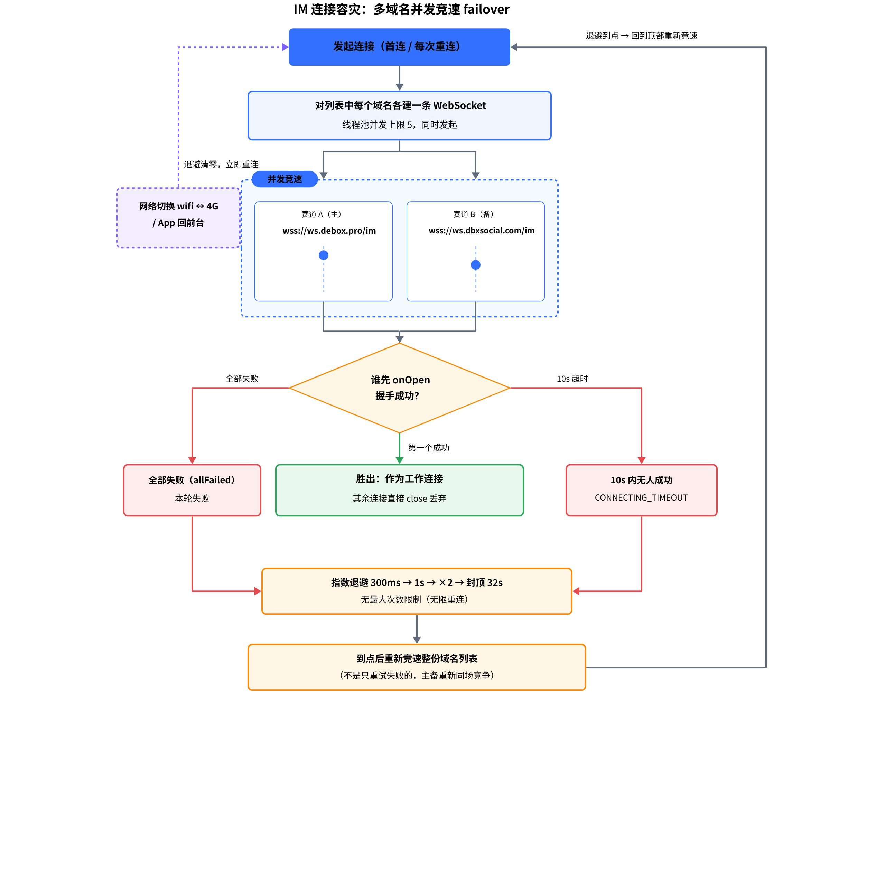

# 

> 飞书 wiki 原文：https://deboxsocial.sg.larksuite.com/wiki/YXmWwaILri6jqkkThu4lQd13gSg （本文件为 2026-07-13 导出的本地备份，流程图为画板导出 PNG）

# 一、为什么 IM 需要单独一道防线

IM 使用 JuggleIM SDK（com.juggle.im:juggle:1.8.47.1）的 WebSocket 长连接（wss），**不经过 RetrofitFactory**——域名切换和 HTTPDNS 两道防线都保护不到它。这个边界在测试中被实测过：DNS 污染期间 HTTP 业务请求靠 HTTPDNS 全部 200，但 IM 顶栏一直显示"连接中"。回环黑洞工单里 IM 永久重连失败正是这个原因，由此推动了多 navi 改造（P0-C3）。

# 二、配置与解析

IM 服务器地址是编译期配置（local.properties → BuildConfig），与 HTTP API 域名池相互独立。生产配置两个不同 hostname 的地址：wss://ws.debox.pro（主）+ wss://ws.dbxsocial.com（备）；测试环境单地址 wss://im-s.debox.pro。选择"不同 hostname"是有意为之——系统 DNS 污染通常按 hostname 生效，备用域名可以绕过针对主域名的污染。

解析逻辑在 AppConstant.getAppNaviListForJ()：按逗号 / 分号拆分、trim、去空、去重、保序（主在前），然后 JIM.getInstance().setServerUrls(list) 注入 SDK。运维扩展域名只需改配置为逗号分隔，无需改代码。

# 三、容灾机制：并发竞速，不是逐个尝试

读 JuggleIM SDK 源码（JWebSocket.connect）确认的关键事实：SDK 对地址列表里的**每个域名同时发起一条 WebSocket 连接**（固定线程池，并发上限 5），互相竞速——第一个握手成功（onOpen）的连接胜出成为工作连接，其余连接直接关闭丢弃；只有全部连接都失败才算一轮失败，进入退避重连。

这个设计带来两个重要推论：**failover 不依赖"感知主域名坏了再换"**——主域名被 DNS 黑洞时它那条连接自然失败，备域名那条并发连接自然胜出；**不需要显式"回切"逻辑**——每次重连都把整份域名列表重新竞速一遍，网络恢复后主备自动重新竞争。

其他细节：URL 会在域名后拼 /im 路径（wss://ws.debox.pro → wss://ws.debox.pro/im）；10 秒内没有任一域名握手成功则判连接超时；服务端关闭原因含 403 时判为鉴权类致命错误（CONNECT_FORBIDDEN），终止重连避免风暴。

# 四、重连与心跳

重连由 SDK 内部状态机驱动（Idle / Connecting / Connected / WaitingForConnect），App 侧只做状态展示、不额外驱动。退避间隔从 300ms 起步，升到 1s 后每次翻倍、封顶 32 秒，**无最大次数限制（无限重连）**。心跳每 10 秒 ping 一次，20 秒收不到任何消息判超时并走重连流程。两个立即重连的信号：网络切换（WiFi↔蜂窝，NetworkChangeReceiver 监听到网络可用）和 App 回到前台——都会把退避间隔清零并立即整体竞速。

注意：本轮改造只做了多 hostname（P0-C3 第①项），**IM 仍走系统 DNS、未接 HTTPDNS**（②③项留作后续补强）。主备域名同时被污染的场景目前无解，Codex review 建议后续用 HTTPDNS 或兜底 IP 直连补强。

# 五、BUG-002：备用域名一度切不过去（端到端验收案例）

真机验证时发现：主域名黑洞后备用 ws.dbxsocial.com 切不过去，IM 卡在重连循环。四步定位（agent-dev-loop 流程 + Codex 独立 review）：

| Track | 假设 | 结论 |
|-|-|-|
| A 读 SDK 源码 | "SDK 不会轮换备用地址" | ❌ 证伪——并发竞速机制健全，备用被真实尝试 |
| B 真机复核 DNS | 备用是否真异线路 | 🔴 备用曾是主域名的 CNAME 同源（同 IP）——形同虚设 |
| C 证书 | 运维改独立站点后 | 🔴 备用域名未绑证书（回落 \*.cdn.myqcloud.com）→ TLS 握手失败，先于一切 WS 逻辑 |
| D WS 路由 | 证书修复后 | 🔴 WS 握手被 400——EdgeOne 站点没把 WS 路由到 IM 网关 |

收口结论：**客户端机制无缺陷，阻断全在服务端 / 运维侧**。证书与 WS 路由两处修复到位后，真机"死主 + 真备"复测 onOpen 成功闭环。这个案例的教训值得推广：**多域名容灾的有效性必须端到端验收（DNS → 证书 → 路由 → 业务），不能只看客户端配置**。残留运维项：备用域名与主域名 IP 已分离但仍同属 EdgeOne 平台，防 hostname 污染有效、防平台级故障无冗余。

# 六、参数速查

| 参数 | 值 |
|-|-|
| 生产 navi | wss://ws.debox.pro、wss://ws.dbxsocial.com（并发竞速） |
| 竞速并发上限 | 5（固定线程池） |
| 连接超时 | 10s（无任一域名成功即判超时） |
| 重连退避 | 300ms → 1s → ×2 → 封顶 32s，无限重连 |
| 心跳 | 10s ping，20s 无消息判超时 |
| WS 路径 | 域名后拼 /im |
| DNS | 系统 DNS（未接 HTTPDNS） |
| 关键源码 | AppConstant.kt（getAppNaviListForJ）、im/imKit/.../jetim/DBXJimCenter.java；SDK 内 JWebSocket / ConnectionManager / IntervalGenerator / HeartbeatManager |
